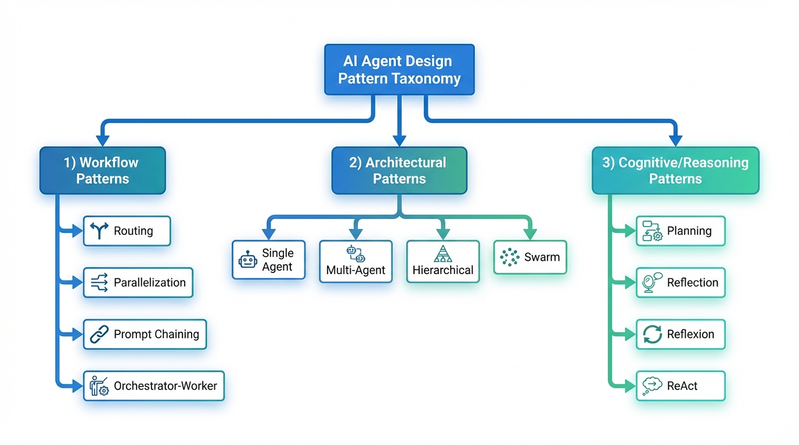
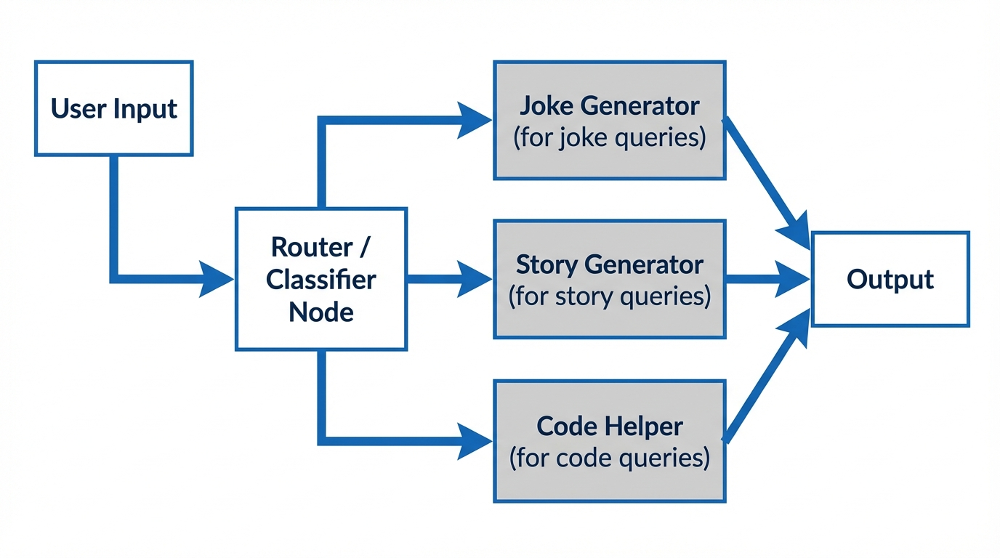
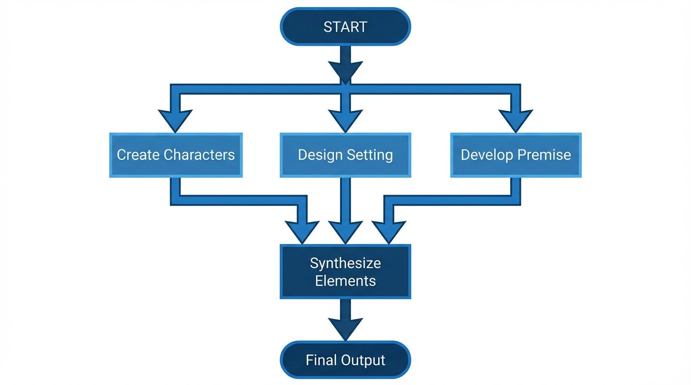
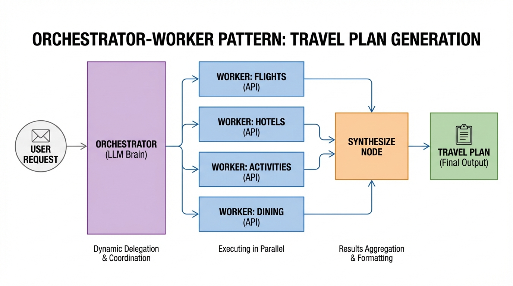
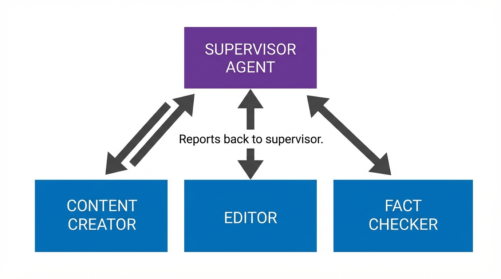
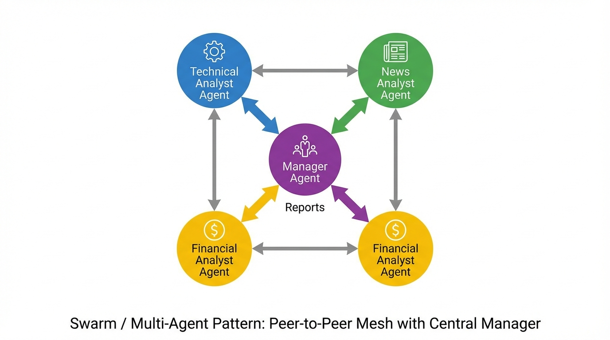
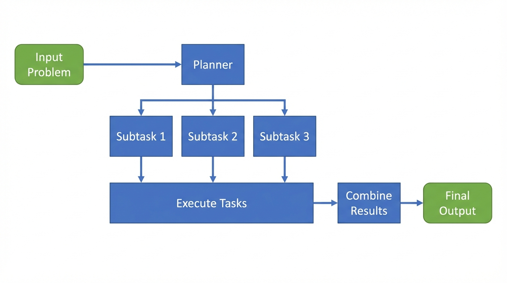
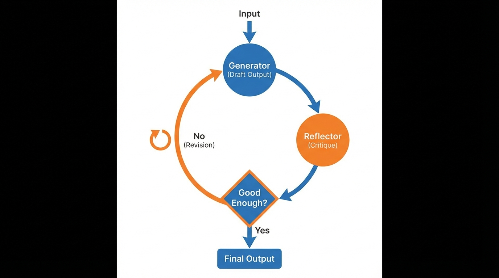
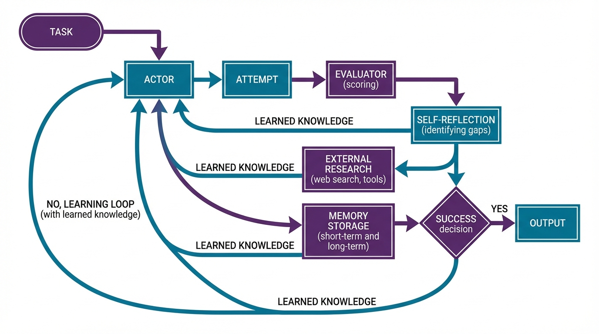

Perfect! Now let me provide you with a comprehensive explanation of each pattern category with the visual diagrams.

---

# **Complete Guide to AI Agent Design Patterns**

## **Overall Taxonomy**



AI Agent Design Patterns are organized into **three main categories**:

1. **Workflow Patterns** - How tasks flow through the system
2. **Architectural Patterns** - How agents are organized and structured
3. **Cognitive/Reasoning Patterns** - How agents think and improve

---

## **CATEGORY 1: WORKFLOW PATTERNS**

These patterns describe **how work flows** and **in what order steps execute**.

### **1.1 Router Pattern**



**Purpose:** Classifies inputs and routes to the most appropriate handler

**How it works:**
- Acts as a traffic controller
- Analyzes input characteristics
- Routes to **ONE** specific handler based on classification
- Uses conditional branching logic

**Key Characteristics:**
- ✅ Sequential execution (only one path runs)
- ✅ Pre-defined routing paths
- ✅ Classification-focused

**Use Cases:**
- **Customer support:** Route queries to billing, technical, or sales departments
- **Content generation:** Direct requests to joke generator, story creator, or code helper
- **Medical triage:** Route patients to appropriate specialists based on symptoms
- **Email filtering:** Categorize emails as spam, priority, or normal

**Example:**
```python
# User asks "Tell me a joke" → Router analyzes → Routes to joke_generator
# User asks "Write a story" → Router analyzes → Routes to story_generator
```

**When to use:**
- Different query types need fundamentally different handling
- You want specialized processing without one-size-fits-all approach
- Clear categorization is possible upfront

---

### **1.2 Parallelization Pattern**



**Purpose:** Execute independent tasks simultaneously to reduce latency

**How it works:**
- Breaks task into **independent** subtasks
- All subtasks run concurrently (fan-out)
- Results are collected and synthesized (fan-in)
- Tasks are **predefined** at design time

**Key Characteristics:**
- ✅ Concurrent execution
- ✅ Tasks don't depend on each other
- ✅ Pre-defined subtasks
- ✅ Significant speed improvement

**Use Cases:**
- **Story generation:** Create characters, setting, and plot simultaneously
- **Market research:** Gather data from multiple sources at once
- **Image processing:** Apply different filters in parallel
- **Data analysis:** Calculate multiple metrics simultaneously
- **Content translation:** Translate document into multiple languages at once

**Example:**
```python
# Story generation:
START → [create_characters, design_setting, develop_premise] 
      → synthesize_elements → END
# All three middle tasks run simultaneously
```

**When to use:**
- Subtasks are completely independent
- Latency reduction is critical
- You want to maximize throughput

**Difference from Multi-Agent:**
- Parallelization has anonymous **nodes/functions**
- Multi-Agent has distinct **agents with personas**

---

### **1.3 Orchestrator-Worker Pattern**



**Purpose:** Dynamic task decomposition with intelligent delegation

**How it works:**
- **Orchestrator LLM** analyzes request at runtime
- Dynamically determines what tasks are needed (not predefined)
- Delegates to specialized **workers**
- Coordinates work and synthesizes final output

**Key Characteristics:**
- ✅ Dynamic task planning
- ✅ Intelligent delegation
- ✅ Runtime decision-making
- ✅ Central coordination

**Use Cases:**
- **Travel planning:** Dynamically plan flights, hotels, activities based on request
- **Research projects:** Break down research questions into investigative tasks
- **Event planning:** Coordinate venue, catering, entertainment, logistics
- **Software development:** Break down features into implementation tasks
- **Data pipeline orchestration:** Dynamically create ETL workflows

**Example:**
```python
# Travel planning:
Orchestrator analyzes "Plan a 5-day trip to Paris for a family"
→ Dynamically creates tasks: accommodation, kid-friendly activities, dining, transport
→ Workers execute in parallel
→ Orchestrator synthesizes final travel itinerary
```

**Key Difference from Parallelization:**
- **Parallelization:** Tasks are **predefined**
- **Orchestrator-Worker:** Tasks are **determined at runtime**

**When to use:**
- Exact steps can't be known in advance
- Complex requests need intelligent breakdown
- Adaptive task planning is required

---

### **1.4 Prompt Chaining Pattern**

**Purpose:** Sequential pipeline where output of one step becomes input to next

**How it works:**
- Step 1 → Step 2 → Step 3 (linear sequence)
- Each step refines or transforms the output
- No branching or parallelization

**Use Cases:**
- **Content refinement:** Draft → Edit → Polish → Format
- **Data processing:** Extract → Transform → Load (ETL)
- **Resume building:** Generate → Tailor → Optimize → Format

**When to use:**
- Clear sequential dependencies
- Each step builds on previous output
- Simple linear workflow

---

## **CATEGORY 2: ARCHITECTURAL PATTERNS**

These patterns describe **system structure** and **how agents are organized**.

### **2.1 Hierarchical/Supervisor Multi-Agent Pattern**



**Purpose:** Central authority controls specialized agents

**How it works:**
- **Supervisor agent** makes all routing decisions
- Worker agents execute tasks
- All communication goes through supervisor (hub-and-spoke)
- Workers report back to supervisor after completion

**Key Characteristics:**
- ✅ Centralized control
- ✅ Clear authority structure
- ✅ Hub-and-spoke communication
- ✅ Predictable workflow

**Use Cases:**
- **Content creation pipeline:** Supervisor → Content Creator → Editor → Fact Checker
- **Software QA:** Manager → Developer → Code Reviewer → Tester
- **Medical diagnosis:** Chief physician → Radiologist → Pathologist → Specialist
- **Financial analysis:** Portfolio manager → Research analyst → Risk analyst → Trader
- **Legal case preparation:** Lead attorney → Researcher → Paralegal → Expert witness coordinator

**Example:**
```python
def supervisor(state) -> Command:
    """Decides which agent works next"""
    return Command(goto="content_creator")

def content_creator(state) -> Command:
    """Creates content, returns to supervisor"""
    return Command(goto="supervisor")
```

**When to use:**
- Clear task delegation needed
- Audit trails important
- Structured workflows
- Single point of control desired

---

### **2.2 Swarm/Peer-to-Peer Multi-Agent Pattern**



**Purpose:** Agents collaborate as equals, handing off control dynamically

**How it works:**
- No central controller
- Agents decide among themselves who handles next
- Direct agent-to-agent communication
- Hand-offs based on expertise

**Key Characteristics:**
- ✅ Decentralized control
- ✅ Peer-to-peer communication
- ✅ Dynamic collaboration
- ✅ Self-organizing

**Use Cases:**
- **Market analysis:** Technical Analyst ↔ News Analyst ↔ Financial Analyst collaborate
- **Customer service:** Agents hand off based on query complexity
- **Brainstorming sessions:** Creative agents contribute ideas dynamically
- **Debugging:** Different experts step in based on error type
- **Healthcare team:** Specialists consult each other directly

**Example:**
```python
# Market analysis team:
Technical Analyst → analyzes charts → hands to News Analyst
News Analyst → checks news impact → hands to Financial Analyst
Financial Analyst → creates report → hands to Manager
```

**Difference from Hierarchical:**

| Aspect | Hierarchical | Swarm |
|--------|-------------|-------|
| Control | Centralized | Decentralized |
| Communication | Through supervisor | Direct peer-to-peer |
| Routing | Supervisor decides | Agents decide |
| Failure point | Single (supervisor) | None |

**When to use:**
- Dynamic conversations needed
- Expertise-based routing
- Flexible collaboration
- No single point of failure desired

---

### **2.3 Single Agent Pattern**

**Purpose:** One agent with tools handles all tasks

**How it works:**
- Single LLM with access to multiple tools
- Agent reasons and decides which tools to use
- Simplest architectural pattern

**Use Cases:**
- **Personal assistant:** Calendar, email, reminders
- **Research assistant:** Web search, summarization
- **Code helper:** Explanation, debugging, generation

**When to use:**
- Tasks are simple or related
- No need for specialized expertise
- Speed and simplicity prioritized

---

## **CATEGORY 3: COGNITIVE/REASONING PATTERNS**

These patterns describe **how agents think, reason, and improve**.

### **3.1 Planning Pattern**



**Purpose:** Think before you act - decompose problems upfront

**How it works:**
1. **Analyze** the problem
2. **Generate plan** (list of subtasks/questions)
3. **Execute** subtasks (often in parallel)
4. **Combine** results into final output

**Key Characteristics:**
- ✅ Upfront decomposition
- ✅ Map-Reduce pattern
- ✅ Parallel execution of subtasks
- ✅ Comprehensive coverage

**Use Cases:**
- **Research reports:** Generate sub-questions → Answer each → Compile report
- **Complex queries:** Break into manageable pieces
- **Project management:** Decompose project into tasks
- **Data analysis:** Split analysis into multiple perspectives
- **Problem-solving:** Break down complex problems systematically

**Example:**
```python
# Research: "What is the state of AI in healthcare?"
Planning Phase: Generate sub-questions
- What are current AI applications in diagnostics?
- What are regulatory challenges?
- What is the market size?
Map Phase: Answer each question in parallel
Reduce Phase: Compile comprehensive report
```

**When to use:**
- Complex tasks benefit from decomposition
- Parallel execution possible
- Comprehensive coverage needed
- Clear sub-problems identifiable

---

### **3.2 Reflection Pattern**



**Purpose:** Self-critique and iterative improvement

**How it works:**
- **Generator:** Creates initial draft
- **Reflector:** Critiques the draft
- **Decision:** Good enough?
  - If No → Loop back to Generator with feedback
  - If Yes → Output final result

**Key Characteristics:**
- ✅ Simple two-role loop
- ✅ No external knowledge
- ✅ Lightweight
- ✅ Quality improvement focus

**Use Cases:**
- **Content editing:** Draft → Critique → Revise → Repeat
- **Code review:** Generate → Review → Fix → Repeat
- **Essay writing:** Write → Self-edit → Rewrite
- **Design iteration:** Create → Critique → Improve
- **Email polishing:** Draft → Review tone/clarity → Refine

**Example:**
```python
Generator: "The product is good."
Reflector: "Too vague. Specify benefits and use active voice."
Generator: "This product increases productivity by 30% through automated workflows."
Reflector: "Good enough!"
```

**When to use:**
- Content polishing needed
- Quality improvement focus
- No external research required
- Simple iterative refinement

---

### **3.3 Reflexion Pattern**



**Purpose:** Learn from mistakes using external knowledge and memory

**How it works:**
- **Actor:** Attempts the task
- **Evaluator:** Scores the attempt (pass/fail)
- **Self-Reflection:** Generates critique + identifies knowledge gaps
- **External Research:** Fills knowledge gaps using tools (web search, retrieval)
- **Memory:** Stores lessons learned (short-term + long-term)
- **Loop:** Retry with accumulated knowledge

**Key Characteristics:**
- ✅ External knowledge integration
- ✅ Memory (episodic learning)
- ✅ Structured evaluation
- ✅ Tool use for research
- ✅ Persistent learning

**Use Cases:**
- **Coding (HumanEval):** Write code → Test → Learn from errors → Research solutions → Retry
- **Problem-solving:** Attempt → Evaluate → Identify gaps → Research → Retry with knowledge
- **Exam preparation:** Answer → Grade → Identify weaknesses → Study → Retry
- **Strategy games:** Play → Analyze moves → Learn patterns → Play better
- **Scientific discovery:** Hypothesis → Experiment → Learn → Refine → Retry

**Example (from your document):**
```
On HumanEval coding benchmark:
- GPT-4 without Reflexion: 80% success
- GPT-4 with Reflexion: 91% success
```

**Difference from Reflection:**

| Aspect | Reflection | Reflexion |
|--------|-----------|-----------|
| External knowledge | No | Yes (tools, search) |
| Memory | No | Yes (short + long term) |
| Complexity | Low | High |
| Use case | Polishing | Learning from failures |

**When to use:**
- Learning from failures essential
- External knowledge needed
- Multiple attempts expected
- Performance improvement over iterations critical

---

### **3.4 ReAct Pattern** (Bonus)

**Purpose:** Reason + Act - interleave thinking and tool use

**How it works:**
- Agent alternates between reasoning and acting
- Thought → Action → Observation → Thought → Action...
- Explicit reasoning traces

**Use Cases:**
- **Web research:** Think about what to search → Search → Analyze results → Think next step
- **Debugging:** Hypothesize bug → Test → Observe → Refine hypothesis

---

## **KEY DIFFERENCES SUMMARY**

### **Workflow vs Architecture vs Cognitive**

| Question | Pattern Category |
|----------|-----------------|
| "In what order do steps execute?" | **Workflow Patterns** |
| "Who does the work and how are they organized?" | **Architectural Patterns** |
| "How does the agent think and improve?" | **Cognitive Patterns** |

### **Quick Comparison Table**

| Pattern | Category | Focus | Key Feature |
|---------|----------|-------|-------------|
| **Router** | Workflow | Classification | Branches to ONE path |
| **Parallelization** | Workflow | Speed | Concurrent execution |
| **Orchestrator-Worker** | Workflow | Dynamic delegation | Runtime task planning |
| **Prompt Chaining** | Workflow | Sequential flow | Linear pipeline |
| **Hierarchical** | Architectural | Structure | Central supervisor |
| **Swarm** | Architectural | Collaboration | Peer-to-peer |
| **Single Agent** | Architectural | Simplicity | One agent with tools |
| **Planning** | Cognitive | Decomposition | Think before act |
| **Reflection** | Cognitive | Quality | Self-critique loop |
| **Reflexion** | Cognitive | Learning | Learn from failures |
| **ReAct** | Cognitive | Reasoning | Interleave thought & action |

---

## **COMBINING PATTERNS**

These patterns are **orthogonal** - you can combine them:

```
Example: Advanced Content Creation System

Architectural: Multi-Agent (Hierarchical)
├── Supervisor Agent
├── Content Creator Agent
├── Editor Agent
└── Fact Checker Agent

Workflow: Orchestrator-Worker + Parallelization
└── Supervisor delegates tasks, agents work in parallel

Cognitive: Reflexion
└── Each agent reflects on output and learns from mistakes
```

---

## **DECISION GUIDE**

**Choose based on your needs:**

1. **Need classification and branching?** → Router
2. **Need speed with independent tasks?** → Parallelization
3. **Don't know tasks upfront?** → Orchestrator-Worker
4. **Need sequential refinement?** → Prompt Chaining
5. **Need clear authority?** → Hierarchical Multi-Agent
6. **Need flexible collaboration?** → Swarm Multi-Agent
7. **Need to decompose complex problems?** → Planning
8. **Need to improve quality iteratively?** → Reflection
9. **Need to learn from failures?** → Reflexion
10. **Need reasoning traces?** → ReAct

---

These design patterns provide a comprehensive toolkit for building sophisticated AI agent systems. Understanding when to use each pattern - and how to combine them - is key to creating effective agent-based solutions for your specific use cases!